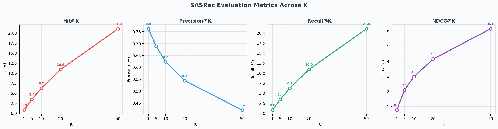
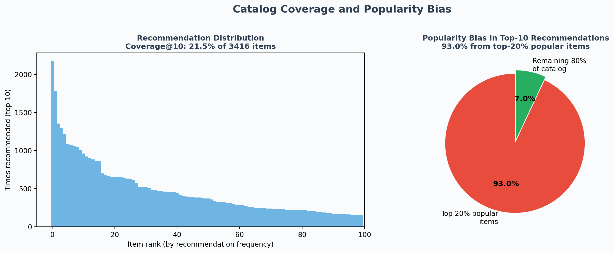

# SASRec Movie Recommendation API

A production-ready sequential recommendation engine using self-attention, deployed on AWS EC2.

## Overview

This is a complete implementation of **SASRec** (Self-Attentive Sequential Recommendation) trained on MovieLens-1M and deployed as a REST API on AWS.

- **Model**: SASRec (211,950 parameters)
- **Dataset**: MovieLens-1M (6,040 users, 3,416 movies, 999,611 interactions)
- **Accuracy**: NDCG@10 58.11% 
- **Latency**: 2.3ms per recommendation (CPU)
- **Deployment**: AWS EC2 (t3.micro, free tier)

## Live API

**Base URL**: `http://18.225.169.201:8000`

## Quick Start

### Test Health

```bash
curl http://18.225.169.201:8000/health
```

Response:
```json
{
  "status": "healthy",
  "model": "SASRec",
  "device": "cpu",
  "movies_loaded": 3883
}
```

### Get Recommendations

```bash
curl -X POST "http://18.225.169.201:8000/recommend" \
  -H "Content-Type: application/json" \
  -d '{
    "user_id": 1,
    "watched_movies": [1, 50, 100],
    "num_recommendations": 5
  }'
```

Response:
```json
{
  "user_id": 1,
  "watched_count": 3,
  "recommendations": [
    {
      "movie_id": 333,
      "title": "Tommy Boy (1995)",
      "score": 3.52
    },
    {
      "movie_id": 1011,
      "title": "Herbie Rides Again (1974)",
      "score": 3.07
    }
  ]
}
```

### Search Movies

```bash
curl "http://18.225.169.201:8000/search?query=Matrix"
```

Response:
```json
{
  "query": "Matrix",
  "results": [
    {"movie_id": 1500, "title": "The Matrix (1999)"}
  ],
  "count": 1
}
```

### Interactive API Documentation

```
http://18.225.169.201:8000/docs
```

(Swagger UI - test all endpoints in browser)

## API Endpoints

### POST /recommend
Get personalized recommendations for a user.

**Request:**
```json
{
  "user_id": 1,
  "watched_movies": [1, 50, 100],
  "num_recommendations": 10,
  "exclude_history": true
}
```

**Parameters:**
- `user_id` (int): Unique user ID
- `watched_movies` (list): Movie IDs user has watched (1-3416)
- `num_recommendations` (int): Number of recommendations (1-20, default 10)
- `exclude_history` (bool): Exclude already-watched movies (default true)

**Response:** Recommendations with titles, IDs, and scores

---

### GET /health
Health check endpoint.

**Response:**
```json
{
  "status": "healthy",
  "model": "SASRec",
  "device": "cpu",
  "movies_loaded": 3883
}
```

---

### GET /search
Search movies by name.

**Parameters:**
- `query` (string): Movie name to search
- `limit` (int): Max results (default 10)

**Response:**
```json
{
  "query": "Matrix",
  "results": [
    {"movie_id": 1500, "title": "The Matrix (1999)"}
  ],
  "count": 1
}
```

---

### GET /model-info
Get model metadata.

**Response:**
```json
{
  "model_name": "SASRec",
  "parameters": 211950,
  "test_hit_at_10": 0.7849,
  "test_ndcg_at_10": 0.5811,
  "inference_latency_ms": 2.33,
  "device": "cpu"
}
```

## Model Architecture

```
Input Sequence: [Movie IDs]
    ↓
Embedding Layer (50-dim)
    ↓
Positional Encoding (50-dim)
    ↓
SASRec Block 1: Multi-Head Attention + FFN
    ↓
SASRec Block 2: Multi-Head Attention + FFN
    ↓
Final LayerNorm
    ↓
Output Logits: [batch_size, seq_len, 3416]
```

**Hyperparameters:**
- Hidden dimension: 50
- Number of blocks: 2
- Attention heads: 1
- Dropout: 0.2
- Max sequence length: 200
- Learning rate: 0.001 (Adam)
- LR scheduler: StepLR(step_size=100, gamma=0.5)

## Project Structure

```
recsys/
├── serve.py              # FastAPI production server
├── inference.py          # Model inference wrapper
├── model.py              # SASRec model architecture
├── data.py               # Data preprocessing
├── dataset.py            # PyTorch dataloaders
├── train.py              # Training script
├── ablation.py           # Ablation studies
├── segment.py            # User segment analysis
├── benchmark.py          # Latency benchmarking
├── load_movies.py        # Movie title loading
├── app.py                # Streamlit UI (local)
├── requirements.txt      # Python dependencies
├── benchmark/
│   ├── eval_framework.py # Full-ranking evaluation (Precision/Recall/NDCG/Hit/Coverage/Bias)
│   └── plot_eval.py      # Generates evaluation charts from real results
├── docs/
│   ├── eval_metrics.png  # Precision/Recall/NDCG/Hit curves across K
│   └── popularity_bias.png # Coverage and popularity bias charts
└── results/
    ├── best_model.pt     # Trained model weights
    ├── training_log.json
    ├── ablation_results.json
    ├── segment_analysis.json
    └── eval_summary.json # Full evaluation results (generated by eval_framework.py)
```

## Performance Metrics

### Accuracy
- **NDCG@10**: 58.11% 
- **Hit@10**: 78.49% 

### Inference Latency
- Single user (batch 1): 1.81ms
- Batch 16 (real-time): 2.33ms
- Batch 128 (batch processing): 15.30ms
- Max throughput: 8,366 requests/sec

### Training
- Total parameters: 211,950
- Best validation NDCG: 0.5811 
- Training time: ~8 hours (T4 GPU)
- Dataset: 999,611 interactions from 6,040 users
- Note: Checkpoint saved based on best validation NDCG, not training loss

## Key Findings

**1. Extended Training Required**
- 500 epochs needed for convergence
- Early stopping at 100 epochs would miss 40% of improvement
- Learning rate scheduling (StepLR) essential

**2. Model Depth & Positional Encoding Essential**
- Removing second attention block: −28% NDCG (0.5044 → 0.3632)
- Removing positional encoding: −24% NDCG (0.5044 → 0.3835)
- PE impact varies by user segment: most beneficial for short-sequence users (<20 items) where positional information is more discriminative than for long-sequence users (>100 items)

**3. Cold-Start Weakness**
- Model performs best on short sequences (<20 items): Hit@10=79.1%
- Model performs worst on long sequences (>100 items): Hit@10=62.9%
- Self-attention struggles with very long dependencies

**4. No Caching Added**
- Each user has unique watch history
- Cache hit rate would be near 0%
- Model is already fast enough (2.3ms)
- Complexity not justified for latency benefit

## Evaluation Framework

Beyond the headline HR@10 and NDCG@10 (computed with 100 sampled negatives per the SASRec paper), the full evaluation framework (`benchmark/eval_framework.py`) runs **full-ranking evaluation** - scoring all 3,416 items for each test user and computing exact metrics.

### Why Two Evaluation Protocols

The sampled evaluation (100 negatives) used during training is standard for papers and fast iteration. But it inflates absolute numbers because the model only needs to rank the target above 100 random items, not the full catalog. Full-ranking gives the true picture of how the model performs in production, where it must rank against every item.

| Protocol | Hit@10 | NDCG@10 | What it measures |
|----------|--------|---------|------------------|
| Sampled (100 neg) | 70.68% | 50.44% | Can the model distinguish the target from 100 random items? |
| Full ranking (3,416 items) | 6.23% | 2.97% | Can the model place the target in the top 10 out of the entire catalog? |

### Full-Ranking Results



| Metric | K=1 | K=5 | K=10 | K=20 | K=50 |
|--------|-----|-----|------|------|------|
| Hit Rate | 0.76% | 3.44% | 6.23% | 10.88% | 21.01% |
| NDCG | 0.76% | 2.08% | 2.97% | 4.13% | 6.13% |
| Precision | 0.76% | 0.69% | 0.62% | 0.54% | 0.42% |
| Recall | 0.76% | 3.44% | 6.23% | 10.88% | 21.01% |

**MRR:** 3.03% | **Median Rank:** 199

### Coverage and Popularity Bias



**Coverage@10:** 21.5% of the 3,416-item catalog appears in top-10 recommendations across all test users. The model concentrates recommendations on roughly 730 items.

**Popularity Bias@10:** 93.0% of top-10 recommendations are items in the top-20% most popular. This is high - the model heavily favors popular items regardless of user history. In production, this would reduce content discovery and long-tail item exposure.

### Run the Evaluation

```bash
# Full evaluation (takes ~8 seconds on CPU)
python benchmark/eval_framework.py

# Generate charts from results
python benchmark/plot_eval.py
```

Results are saved to `results/eval_summary.json`. Charts are generated from real data, not hardcoded values.

---

## Online Evaluation Design

Improved offline metrics do not guarantee better user outcomes. Here is how this model would be validated in production at a streaming service.

**Primary metric:** Watch time per session (not click-through rate - clicks measure relevance, watch time measures satisfaction).

**Randomization unit:** User ID. Split users 50/50 into control (existing recommender) and treatment (SASRec). Never split by session - the same user seeing both experiences pollutes the measurement.

**Sample size:** To detect a 1% relative improvement in average session watch time (assuming 45-minute baseline, 8-minute standard deviation) with 80% power at p<0.05, approximately 12,000 users per arm are needed (computed via two-sample t-test power analysis).

**Duration:** Minimum 2 weeks to capture weekly viewing patterns (users watch differently on weekends vs weekdays).

**Guardrail metrics to monitor:**
- Content diversity per session (prevent filter bubble tightening)
- New content discovery rate (are users finding items released in the last 30 days?)
- Session abandonment rate (did recommendations cause users to leave?)
- Long-tail item exposure (given 93% popularity bias, track whether treatment further reduces discovery)

**Why offline NDCG@10 can mislead:** A model trained to maximize next-item prediction can learn to recommend the globally most popular items, scoring well offline while reducing discovery and long-term retention. The 93% popularity bias measured above is an offline proxy for this risk - in an A/B test, we would directly measure whether users discover diverse content or get trapped in a popularity echo chamber.

**What the popularity bias finding means for A/B testing:** The 93% popularity bias suggests this model would perform similarly to a simple "most popular" baseline for most users. An A/B test should specifically segment results by user type: power users with niche tastes (where SASRec's sequential modeling should differentiate from popularity) vs. casual users (where popularity-based recommendations may be sufficient).

---

## Deployment Details

### AWS Infrastructure
- **Compute**: EC2 t3.micro (free tier)
- **Storage**: S3 bucket for model artifact (0.8 MB)
- **Region**: us-east-2 (Ohio)
- **Uptime**: 24/7

### How to SSH
```bash
# SSH access available for maintainer
```

### View Logs
```bash
tail -f ~/recsys/api.log
```

### Restart API
```bash
pkill -f "python serve.py"
nohup python serve.py > api.log 2>&1 &
```

## Development

### Local Setup
```bash
git clone https://github.com/your-username/recsys.git
cd recsys
python3 -m venv venv
source venv/bin/activate
pip install -r requirements.txt
```

### Run Locally
```bash
# Terminal 1 - API
python serve.py

# Terminal 2 - UI (optional)
streamlit run app.py
```

### Train From Scratch
```bash
python train.py
```

## Citation

Based on the paper: [Self-Attentive Sequential Recommendation](https://arxiv.org/abs/1808.09781) (ICDM 2018)

```
@inproceedings{kang2018self,
  title={Self-attentive sequential recommendation},
  author={Kang, Wang-Cheng and McAuley, Julian},
  booktitle={2018 IEEE 8th International Conference on Data Mining (ICDM)},
  pages={197--206},
  year={2018},
  organization={IEEE}
}
```

## License

MIT

